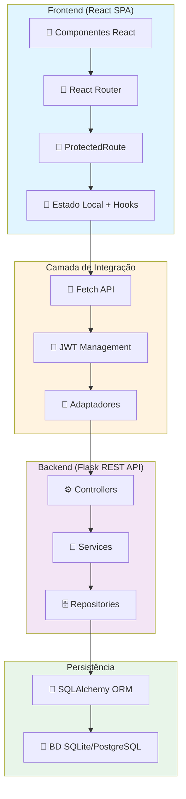
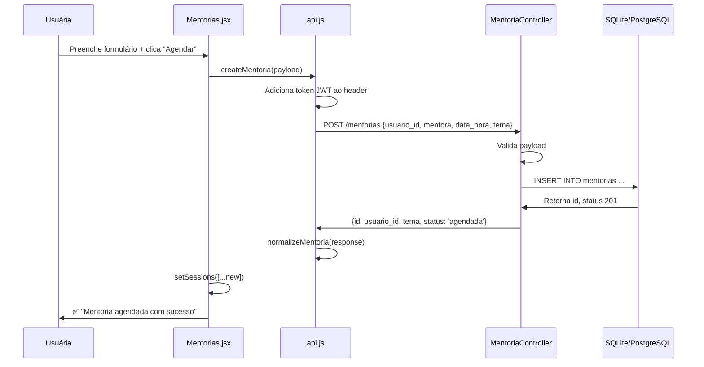

# Documentação Arquitetural - Empreenda Mais Elas

## 1. Visão Geral da Arquitetura

### Qual problema o sistema resolve?

A plataforma **Empreenda Mais Elas** resolve as barreiras críticas que impedem o crescimento de micro-negócios liderados por mulheres, especialmente em cenários regionais. As principais barreiras atacadas são:

- **Exclusão digital:** Falta de acesso a ferramentas e conhecimento tecnológico
- **Analfabetismo financeiro:** Ausência de capacitação em gestão e finanças
- **Isolamento comercial:** Dificuldade para conectar com mercado e parceiros
- **Acesso a crédito:** Falta de pontes com instituições financeiras

### Qual é o objetivo do MVP?

Criar uma plataforma integrada que:

- Oferece educação digital e empresarial acessível e personalizada
- Conecta empreendedoras com mentores especializados
- Fornece um marketplace para venda e exposição de produtos
- Monitora impacto social e desempenho das empreendedoras

### Quem são os usuários?

1. **Empreendedoras:** Mulheres em fase de ideia ou com negócio ativo, buscando crescimento
2. **Administradoras:** Gestoras da plataforma responsáveis por monitoramento e aprovação
3. **Mentoras:** Voluntárias especializadas (SEBRAE, instituições parceiras) que orientam
4. **Consumidoras:** Possíveis compradoras no marketplace

### Como a aplicação está organizada?

A arquitetura segue um modelo **cliente-servidor** com separação clara entre:

- **Frontend SPA (React):** Interface responsiva e dinâmica
- **Backend API REST (Flask):** Lógica de negócio e persistência
- **Banco de Dados (SQLite/PostgreSQL):** Armazenamento centralizado

---

## 2. Modelo Arquitetural do Sistema

### a) Estrutura em Camadas

```
┌─────────────────────────────────────────┐
│           Camada de Apresentação        │
│  (Frontend React - SPA - Vite + React)  │
├─────────────────────────────────────────┤
│         Camada de Integração            │
│   (Proxy Vite + Cliente HTTP Fetch)     │
├─────────────────────────────────────────┤
│    Camada de Lógica de Negócio          │
│  (Backend Flask - Controllers/Services) │
├─────────────────────────────────────────┤
│      Camada de Persistência             │
│ (SQLAlchemy ORM + SQLite/PostgreSQL)    │
├─────────────────────────────────────────┤
│        Camada de Configuração           │
│  (Environment Variables + Flask Config) │
└─────────────────────────────────────────┘
```

**Camada 1: Apresentação (Frontend)**

- Construída com React 19 + Vite
- Gerenciamento de rotas com React Router
- Componentização com Tailwind CSS
- Responsividade garantida para mobile, tablet e desktop

**Camada 2: Integração**

- Proxy Vite para evitar problemas CORS em desenvolvimento
- Cliente HTTP customizado (`api.js`) com gerenciamento de tokens JWT
- Adaptadores para normalizar dados da API

**Camada 3: Lógica de Negócio (Backend)**

- Framework Flask com Flask-RESTx para APIs REST
- Controllers encapsulam regras de negócio
- Services implementam lógica complexa
- Repositories padrão para acesso ao banco

**Camada 4: Persistência**

- SQLAlchemy como ORM
- Modelos dataclass para tipagem
- Migrations com Alembic
- Suporte a SQLite (dev) e PostgreSQL (produção)

**Camada 5: Configuração**

- Arquivo `config.py` centraliza parâmetros
- Variáveis de ambiente para sensibilidade
- Ativação de recurso AUTO_CREATE_DB para dev

---

### b) Componentes da Aplicação

#### **Módulo de Autenticação**

- **Função:** Controlar acesso e sessões de usuárias
- **Componentes:**
  - `AuthController` (backend): Valida credenciais, gera tokens JWT
  - `LoginPage` / `RegisterPage` (frontend): Interfaces de entrada
  - `ProtectedRoute` (frontend): Guard para rotas privadas
- **Comunicação:** POST `/auth/login`, POST `/auth/register`, GET `/auth/me`
- **Importância:** Porta de entrada e segurança de dados pessoais

#### **Módulo de Gestão de Usuárias**

- **Função:** CRUD de perfis, papéis (empreendedora/admin/mentora)
- **Componentes:**
  - `User` (model): Entidade de usuária
  - `UserController` (backend): Listagem, atualização
  - Dashboard (frontend): Exibe dados da usuária logada
- **Comunicação:** GET `/usuarios`, GET `/usuarios/<id>`
- **Importância:** Base de dados para toda personalização

#### **Módulo de Diagnóstico**

- **Função:** Mapear estágio do negócio (Fase de Ideia vs. Ativo)
- **Componentes:**
  - `Diagnosis` (model): Resposta ao questionário
  - `DiagnosticController` (backend): Persiste respostas
  - `Diagnostico.jsx` (frontend): Formulário dinâmico
  - `LearningOpsService`: Lógica de triagem
- **Comunicação:** POST `/aprendizagem/diagnosticos`
- **Importância:** Define trilha personalizada e recomendações

#### **Módulo de Trilhas de Aprendizagem**

- **Função:** Oferecer conteúdos estruturados e progressivos
- **Componentes:**
  - `Trilha`, `TrilhaItem`, `Conteudo` (models): Estrutura
  - `TrilhaController` (backend): CRUD e associação
  - `Trilhas.jsx` (frontend): Visualização e progresso
  - `ProgressoConteudo` (model): Rastreamento individual
- **Comunicação:** GET `/trilhas`, POST `/trilhas`, GET/PUT `/aprendizagem/progressos`
- **Importância:** Diferencial de personalização e educação

#### **Módulo de Mentorias**

- **Função:** Conectar empreendedoras com especialistas
- **Componentes:**
  - `Mentoria` (model): Sessão agendada
  - `MentoriaController` (backend): CRUD e busca disponibilidade
  - `Mentorias.jsx` (frontend): Agendamento com formulário
  - `AvaliadorMentoria` (model): Feedback pós-sessão
- **Comunicação:** GET `/mentorias`, POST `/mentorias`, PUT `/mentorias/<id>`
- **Importância:** Suporte humano direto e orientação prática

#### **Módulo de Marketplace**

- **Função:** Vitrine para venda de produtos/serviços
- **Componentes:**
  - `Produto` (model): Item à venda
  - `Anuncio` (model): Exposição do produto
  - `Pedido`, `ItemPedido` (models): Transação
  - `ProductController` (backend): Catálogo
  - `Marketplace.jsx` (frontend): Listagem com busca
  - `PainelEmpreendedora.jsx`: Gestão de vendas
- **Comunicação:** GET `/produtos`, POST `/produtos`, GET `/pedidos`, POST `/pedidos`
- **Importância:** Geração de receita e sustentabilidade

#### **Módulo de Painel Administrativo**

- **Função:** Monitoramento de impacto social e aprovação de lojas
- **Componentes:**
  - `PainelAdministrativoVisaoGeral.jsx` (frontend): Dashboard com métricas
  - Agregação de dados de múltiplos endpoints
- **Comunicação:** GET `/usuarios`, GET `/trilhas`, GET `/pedidos`, GET `/produtos`
- **Importância:** Governança e tomada de decisão estratégica

#### **Módulo de Finanças (Finance Ops)**

- **Função:** Gestão de faturas, pagamentos e fluxo de caixa
- **Componentes:**
  - `Invoice`, `Payment` (models): Contratos financeiros
  - `FinanceController` (backend): Cálculo e reconciliação
- **Comunicação:** GET/POST `/financeiro/faturas`, GET/POST `/financeiro/pagamentos`
- **Importância:** Rastreamento de ganho e sustentabilidade

#### **Módulo de Suporte (Support)**

- **Função:** Endereços, métricas de engajamento, notificações
- **Componentes:**
  - `Address`, `EventMetric`, `Notification` (models)
  - `SupportController` (backend): CRUD
- **Comunicação:** GET/POST `/suporte/enderecos`, `/suporte/metricas`, `/suporte/notificacoes`
- **Importância:** Infraestrutura de comunicação e dados demográficos

---

### c) Tecnologias Utilizadas

#### **Frontend**

| Tecnologia | Versão | Justificativa |
|---|---|---|
| **React** | 19.2.6 | Renderização declarativa, componentização, estado global eficiente, grande comunidade |
| **Vite** | 8.0.12 | Build rápido com HMR, melhor performance que Webpack, ideal para SPA moderna |
| **React Router** | 7.1.1 | Navegação SPA nativa, suporte a lazy loading, fallbacks e proteção de rotas |
| **Tailwind CSS** | 3.4.19 | Utility-first, responsivo por padrão, reduz CSS customizado, acelera prototipagem |
| **JavaScript** | ES2024 | Sintaxe moderna, destructuring, arrow functions, async/await para API calls |

**Decisões:**

- Vite em vez de Create React App: Performance, HMR mais rápido
- Tailwind em vez de styled-components: Menos JS em runtime, melhor performance

#### **Backend**

| Tecnologia | Versão | Justificativa |
|---|---|---|
| **Python** | 3.10+ | Legibilidade, rapidez de desenvolvimento, excelente ecosistema data science/ML |
| **Flask** | 2.x | Leve, flexível, ideal para MVP, baixa curva de aprendizado |
| **Flask-RESTx** | 0.5.x | Documentação Swagger automática, marshallers, validação integrada |
| **SQLAlchemy** | 2.0+ | ORM madura, segurança contra SQL injection, suporta múltiplos bancos |
| **Flask-Migrate** | Alembic | Versionamento de schema, rollbacks seguros, reproducibilidade |
| **Flask-JWT-Extended** | 4.x | Tokens JWT seguros, refresh tokens, permissões granulares |

**Decisões:**

- SQLAlchemy em vez de SQLite direto: Portabilidade, segurança, facilita testes
- JWT em vez de session cookies: Stateless, melhor para APIs, escalável

#### **Banco de Dados**

| Tecnologia | Versão | Ambiente | Justificativa |
|---|---|---|---|
| **SQLite** | 3.x | Desenvolvimento | Sem setup, arquivo local, ideal para prototipagem |
| **PostgreSQL** | 13+ | Produção | Robusto, escalável, suporta índices complexos e JSON |

**Decisões:**

- Separar SQLite (dev) de PostgreSQL (prod): Rapidez de setup em dev, confiabilidade em prod

#### **Infraestrutura & DevOps**

| Tecnologia | Justificativa |
|---|---|
| **Git** | Versionamento, rastreabilidade, colaboração |
| **GitHub** | Hospedagem, CI/CD, issue tracking |
| **Environment Variables** | Configuração sensível, flexibilidade entre ambientes |
| **Docker** (planejado) | Containerização, consistência dev/prod, deploy facilitado |

---

### d) Integrações do Sistema

#### **Integrações Realizadas**

1. **Autenticação JWT**
   - Token armazenado no localStorage (frontend)
   - Validação em cada requisição (backend)
   - Refresh automático planejado

2. **Frontend ↔ Backend via API REST**
   - Proxy Vite evita CORS em desenvolvimento
   - Cliente HTTP customizado com retry logic
   - Normalização de dados com adaptadores

3. **Banco de Dados Centralizado**
   - SQLAlchemy mapper -> Modelos Python -> Serialização JSON
   - Consistent state entre múltiplos usuários via transactions

#### **Integrações Planejadas**

1. **Email Marketing & Notificações**
   - SendGrid ou AWS SES para disparos
   - Notificações de mentoria, produtos novos, trilhas disponíveis

2. **Serviços de Pagamento**
   - Stripe ou Mercado Pago para pedidos no marketplace
   - Webhooks para confirmação de transação

3. **Mapas (Google Maps)**
   - Localização geográfica de empreendedoras
   - Busca por proximidade no marketplace

4. **Inteligência Artificial**
   - Recomendações de trilhas baseadas em perfil
   - Chatbot para suporte ao cliente

5. **Analytics & Monitoramento**
   - Google Analytics para comportamento de usuárias
   - Sentry para erro tracking em produção

---

## 3. Decisões Arquiteturais

### Decisão 1: Arquitetura Cliente-Servidor com API REST

**Escolha:** Separar frontend (React SPA) do backend (Flask API REST)

**Justificativa:**

- **Escalabilidade:** Backend pode escalar independente do frontend
- **Reusabilidade:** API pode servir web, mobile e integrações futuras
- **Segurança:** Lógica sensível fica protegida no servidor
- **Manutenção:** Mudanças de UI não afetam lógica de negócio

**Impacto:**

- ✅ Facilita testes unitários de cada camada
- ✅ Permite deploy independente
- ⚠️ Requer mais requisições HTTP (atenuado com caching)

---

### Decisão 2: Uso de JWT para Autenticação

**Escolha:** Tokens JWT em vez de session cookies tradicionais

**Justificativa:**

- **Stateless:** Servidor não armazena sessões, escalável horizontal
- **Móvel-friendly:** Funciona bem em apps nativas
- **Segurança:** Assinatura criptográfica valida integridade

**Impacto:**

- ✅ Reduz carga no backend
- ✅ Facilita microsserviços futuros
- ⚠️ Token no localStorage (XSS risk) - mitigado com CSP

---

### Decisão 3: Arquitetura em Camadas (Controller-Service-Repository)

**Escolha:** Separação de responsabilidades em 3 camadas lógicas

```
Request → Controller → Service → Repository → DB
```

**Justificativa:**

- **Manutenção:** Mudanças isoladas por responsabilidade
- **Testabilidade:** Cada camada testável independente
- **Reutilização:** Services usáveis em múltiplos endpoints

**Impacto:**

- ✅ Código previsível e fácil de navegar
- ✅ Novos desenvolvedores onboardam rápido
- ⚠️ Mais arquivos (overhead inicial pequeno)

---

### Decisão 4: Componentização React com Roteamento SPA

**Escolha:** Single Page Application em vez de Multi-Page Application

**Justificativa:**

- **UX:** Navegação sem reload (transições suaves)
- **Performance:** Carrega JS uma vez, muda apenas conteúdo
- **Estado:** Gerenciamento de estado simples com hooks
- **Offline:** Funcionalidades podem persistir sem conexão

**Impacto:**

- ✅ Experiência mais fluida para usuárias
- ✅ Menor uso de bandwidth
- ⚠️ Requer otimização de bundle size

---

### Decisão 5: Normalização de Dados com Adaptadores

**Escolha:** Camada de adaptadores entre API bruto e UI

**Justificativa:**

- **Acoplamento Fraco:** Frontend não quebra se API mudar campos
- **Consistência:** Dados sempre no mesmo formato na UI
- **Reutilização:** Adaptadores para múltiplas telas

**Impacto:**

- ✅ Facilita mudanças no backend
- ✅ Testes de UI previsíveis
- ⚠️ Overhead mínimo (trades performance por flexibilidade)

---

### Decisão 6: Proteção de Rotas com Guard Component

**Escolha:** Component `ProtectedRoute` que valida token antes de renderizar

**Justificativa:**

- **Segurança:** Impede acesso não autorizado à UI
- **UX:** Redirect automático se token expirado
- **Simplicidade:** Uma linha de código por rota protegida

**Impacto:**

- ✅ Segurança transparente
- ✅ Código declarativo e legível
- ⚠️ Valida apenas no cliente (necessário validar servidor também)

---

### Decisão 7: Banco de Dados SQLAlchemy + Alembic

**Escolha:** ORM + migrations em vez de SQL raw

**Justificativa:**

- **Portabilidade:** Mesma código para SQLite/PostgreSQL/MySQL
- **Segurança:** Prepared statements contra SQL injection
- **Versionamento:** Histórico de schema, rollbacks

**Impacto:**

- ✅ Reduz bugs de SQL
- ✅ Fácil mudança de BD futura
- ⚠️ Performance: Pode ser menor que SQL otimizado (aceitável para MVP)

---

## 4. Uso de Boas Práticas e Padrões Arquiteturais

### Boas Práticas Implementadas

#### **Clean Code**

- Nomes descritivos para variáveis, funções e classes
- Funções pequenas com responsabilidade única
- Ausência de código duplicado (DRY - Don't Repeat Yourself)
- Exemplo: `normalizeProduct()` em vez de `convert_product_to_ui()`

#### **Separação de Responsabilidades (SoC)**

- Controllers: Apenas roteamento e validação
- Services: Lógica de negócio complexa
- Repositories: Apenas acesso ao banco
- Exemplo: Cálculo de recomendação em Service, não em Controller

#### **Componentização React**

- Componentes reutilizáveis (`ProtectedRoute`, `StatusBadge`)
- Props bem definidas
- State local quando apropriado
- Custom hooks para lógica compartilhada (futuro)

#### **Responsividade & Acessibilidade**

- Tailwind com breakpoints mobile-first
- Alt text em imagens
- Contraste de cores validado
- Navegação por teclado suportada

#### **Segurança**

- JWT com expiração de token
- Senhas hasheadas com bcrypt
- CORS configurado (proxy Vite)
- Validação de entrada no backend (Flask-RESTx)

#### **Versionamento Git**

- Histórico limpo com commits descritivos
- Branches para features/bugfixes
- README documentado
- .gitignore atualizado

---

### Padrões Arquiteturais Adotados

#### **MVC (Model-View-Controller)**

**Backend:**

- **Model:** Classes dataclass em `app/models/`
- **View:** Controllers em `app/api/namespaces/`
- **Controller:** Lógica em `app/services/` e `app/repositories/`

**Frontend:**

- **Model:** Estado em hooks + adaptadores
- **View:** Componentes React
- **Controller:** Handlers de eventos

#### **REST (Representational State Transfer)**

- Recursos como URLs: `/produtos`, `/mentorias`, `/pedidos`
- Métodos HTTP semânticos: GET (leia), POST (crie), PUT (atualize), DELETE (remova)
- Respostas JSON padronizadas com status codes HTTP

#### **Arquitetura em Camadas**

```
Presentação (React) 
    ↓
Integração (Fetch API + Adaptadores)
    ↓
Lógica (Controllers/Services)
    ↓
Persistência (SQLAlchemy)
    ↓
Banco (SQLite/PostgreSQL)
```

#### **Client-Server**

- **Cliente:** Realiza requisições, renderiza UI
- **Servidor:** Processa regras de negócio, persiste dados
- **Comunicação:** HTTP sobre REST

#### **SPA (Single Page Application)**

- Uma página HTML carregada uma vez
- Roteamento em JavaScript (React Router)
- Navegação sem reload completo

#### **Dependency Injection (parcial)**

- Container central em `app/container.py`
- Controllers recebem services injetados
- Facilita testes com mocks

---

### Código Exemplo de Padrões

**Model + Service + Controller (Backend)**

```python
# Model
@dataclass
class Mentoria:
    usuario_id: int
    mentora: str
    data_hora: str
    tema: str

# Service
def agendar(payload):
    mentoria = Mentoria(**payload)
    if not self.repository.verificar_disponibilidade(mentoria.data_hora):
        raise ValueError("Horário indisponível")
    return self.repository.save(mentoria)

# Controller
def post(self):
    return container.mentoria_controller.agendar(payload)
```

**Adapter + Component (Frontend)**

```javascript
// Adapter: normaliza dados da API
export function normalizeMentoria(mentoria = {}) {
  return {
    id: mentoria.id ?? null,
    tema: mentoria.tema ?? '',
    dataHora: mentoria.data_hora ?? '',
    status: mentoria.status ?? 'agendada',
  }
}

// Component: usa dados normalizados
function Mentorias() {
  const [sessions, setSessions] = useState([])
  useEffect(() => {
    listMentorias()
      .then(data => setSessions(data.map(normalizeMentoria)))
  }, [])
  return <div>{sessions.map(s => <div key={s.id}>{s.tema}</div>)}</div>
}
```

---

## 5. Diagrama Arquitetural Completo



---

## 6. Fluxo de Dados Exemplificado

### Caso de Uso: Agendar Mentoria



---

## 7. Escalabilidade & Evolução Futura

### Curto Prazo (1-2 meses)

- [ ] Implementar refresh tokens
- [ ] Adicionar rate limiting
- [ ] Tests E2E com Cypress
- [ ] Caching com Redis

### Médio Prazo (3-6 meses)

- [ ] Microsserviços para Finance + Analytics
- [ ] Containerização Docker
- [ ] CI/CD com GitHub Actions
- [ ] Webhook para notificações email

### Longo Prazo (6+ meses)

- [ ] Mobile app (React Native)
- [ ] AI para recomendações
- [ ] Integração de pagamento (Stripe)
- [ ] Geolocalização de empreendedoras

---

## 8. Conclusão

A arquitetura de **Empreenda Mais Elas** foi desenhada para ser:

- **Acessível:** Interfaces intuitivas e lógica de negócio clara
- **Escalável:** Separação de camadas permite crescimento
- **Segura:** Autenticação JWT, validação de entrada, proteção de rotas
- **Mantível:** Padrões consistentes, código documentado, responsabilidades claras
- **Extensível:** Fácil adicionar novos módulos (marketplace, finanças, suporte)

A escolha de tecnologias modernas (React, Flask, SQLAlchemy) e práticas sólidas (Clean Code, SoC, REST) garante que a plataforma pode evoluir de MVP para produto maduro sem refatoração completa.
